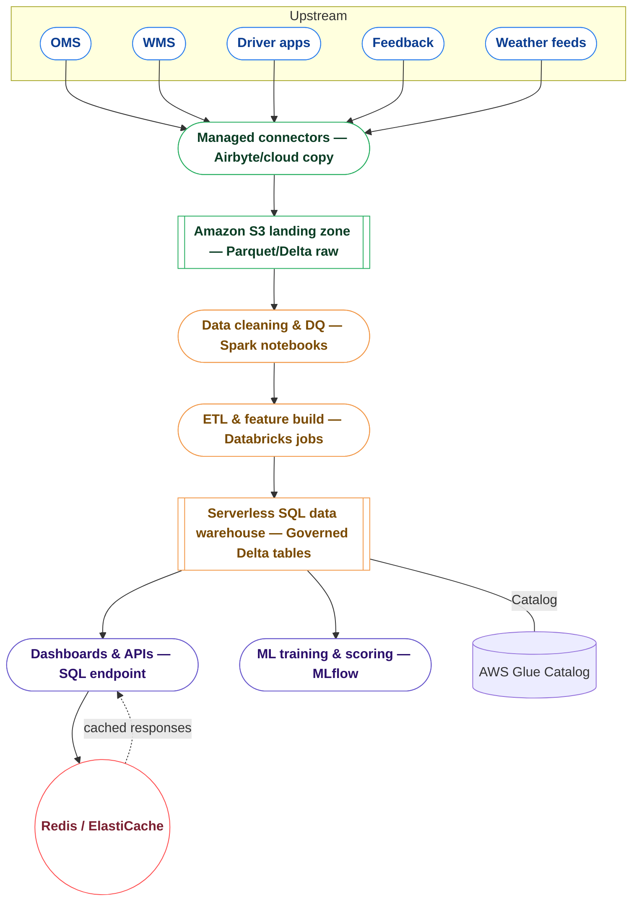
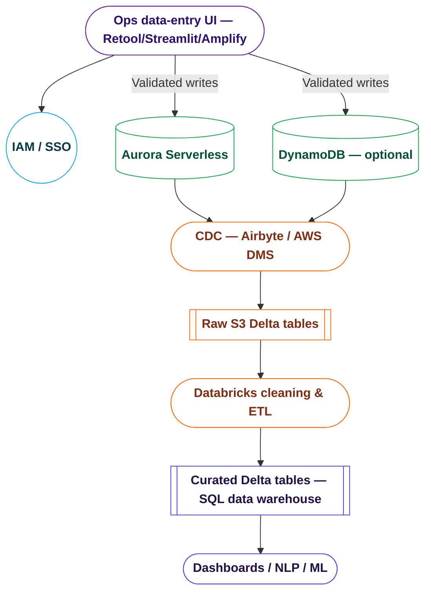

# Delivery Intelligence Platform – Scalable but Straightforward Plan

**Executive summary:** We will lift the assignment prototype into a production-ready, cloud-native platform by keeping the same analytics logic but moving storage, compute, and caching to a single, elastic stack. Data lands once in low-cost object storage, Spark cleaning notebooks validate it, ETL jobs build curated tables in a serverless SQL data warehouse, Redis delivers instant responses for common NLP queries, and both dashboards and the NLP service share the same governed dataset. This architecture is inexpensive at a few GB, grows to TBs without rewrites, and keeps ML training/serving on the same pipeline.

**Chosen production stack:**
- **Storage:** Amazon S3 with Parquet/Delta tables for raw and curated data.
- **Processing & data warehouse:** Databricks Serverless SQL/Spark runs ingestion, cleaning notebooks, ETL/feature jobs, and keeps the governed SQL data warehouse that analytics and ML share.
- **Catalog:** AWS Glue so every table and schema is discoverable and governed.
- **Caching:** Redis/ElastiCache so repeated NLP questions return instantly without re-running Spark jobs.

Our goal is to take the assignment prototype (everything in-memory, CSV-based) and stand up a production baseline that stays cost-effective at a few GB today and can keep scaling into the TB range without swapping technologies.

---

## 1. Prototype vs. Production – quick context

| Topic | Prototype choice | Why it worked for the assignment | Production adjustment |
| --- | --- | --- | --- |
| Storage | CSVs loaded by pandas | Fast to iterate, zero ops | Land data once in Amazon S3 as Parquet/Delta tables and register them in AWS Glue |
| Processing | In-memory joins & ML | Simple, good for < 1–2 GB | Use one Databricks Serverless SQL/Spark workspace to run cleaning notebooks, ETL jobs, and ML on an auto-scaling engine |
| Analytics access | Python scripts only | Enough for demo | Expose the Databricks serverless SQL data warehouse for BI + API use |
| ML training | Local scikit-learn | Quick experiments | Run the same scikit-learn code on Databricks jobs and track runs with MLflow |
| Response caching | Not implemented | Dataset small, queries inexpensive | Store hot query results in Redis/ElastiCache to avoid re-running identical analytics and cut per-query compute cost |

The production design keeps the same logical steps but moves the heavy lifting to managed, pay-as-you-go services so we only pay for what we use.

---

## 2. Single baseline architecture we can use from day one



The flow is intentionally linear: data lands on S3, Spark-based cleaning notebooks enforce quality gates, ETL notebooks shape trusted Delta tables inside the serverless SQL data warehouse, and every consumer—dashboards, APIs, NLP, and ML—pulls from that governed layer while Redis accelerates repeat lookups.

### Making data updates simple (no more CSV uploads)

- **Business users get a lightweight UI:** Instead of emailing CSVs, we stand up a small form-based app (Retool, Streamlit, or an Amplify-hosted React UI) where operations teams can add, edit, or bulk import records with validation.
- **Changes land in a serverless operational store:** The UI writes into an Amazon Aurora Serverless (PostgreSQL) or DynamoDB table sized for interactive updates. This keeps response times low and lets us enforce referential rules.
- **Pipelines stay in sync automatically:** Airbyte (or AWS DMS) streams those operational tables into the raw S3 zone every few minutes. The same Spark jobs then rebuild curated Delta tables, so analytics and NLP see the new data without manual steps.
- **Governance improves:** Every change is timestamped, attributed to a user account, and can be rolled back. Validation rules catch typos before they hit analytics, and we can expose approval workflows if needed.
- **Cost stays controlled:** The UI tooling is pay-per-seat, Aurora Serverless scales to zero when idle, and incremental CDC jobs move only the new rows—far cheaper than full CSV reloads.



Why this works:
1. **One stack to learn:** Databricks Serverless is cheap to keep idle yet scales automatically, so we don’t redeploy anything when traffic or data grows.
2. **Data stays portable:** Storing everything as Parquet/Delta on S3 means the same files can be read by any future tool without copying.
3. **Storage cost stays predictable:** S3 is pennies per GB, letting us keep full history without deleting or archiving elsewhere.
4. **Analytics and ML share code:** The same Databricks workspace maintains the SQL data warehouse, serves dashboards, and runs model training, so there’s no second engine to maintain.
5. **Fast answers, lower compute bills:** Redis serves repeat NLP questions instantly, which keeps the Spark cluster free for new work.

We avoid relying on PostgreSQL for massive datasets because its performance drops once tables grow into tens of millions of rows. The S3 + Databricks + Redis setup keeps the cost profile low today and smoothly scales into the terabyte range by paying only for additional compute minutes.

---

## 3. Data flow in production (keeps logic the same)

```mermaid
flowchart TB
	subgraph Pipeline [Landing → Cleaning → ETL]
	  direction TB
	  Src([Source systems]) --> Ingest([Ingestion jobs])
	  Ingest --> LandingNode[[S3 landing (raw Parquet/Delta)]]
	  LandingNode --> Cleaning([Cleaning & Great Expectations])
	  Cleaning --> ETL([ETL & Feature build])
	  ETL --> DW[[SQL data warehouse (modeled Delta tables)]]
	end

```mermaid
flowchart TB
	subgraph Consumption [Warehouse → Consumers]
	  direction TB
	  DW[[SQL data warehouse (modeled Delta tables)]] --> Dash([Dashboards & APIs])
	  DW --> NLP([NLP service])
	  DW --> ML([ML jobs — MLflow])
	  NLP --> Redis((Redis cache))
	  Redis -. cached responses .-> NLP
	  ML --> DW
	end
```

1. **Ingestion to the landing zone** – Scheduled jobs copy new orders, drivers, feedback, etc. into raw Parquet/Delta folders on S3 (keeps upstream systems decoupled and guarantees every run starts from the same source). For the first release this can run hourly or nightly; streaming can be enabled later without changing storage.
2. **Cleaning & validation** – Spark notebooks run lightweight cleansing, schema alignment, and Great Expectations checks so only trusted rows progress (no more manual CSV fixes, and auditors can see every failure).
3. **ETL & feature modeling** – The same serverless Spark jobs build fact/dimension tables plus the unified analytics dataset, then load them into the governed Delta/SQL data warehouse. This step mirrors `create_unified_dataset`, but scales and can be re-run incrementally.
4. **Serve analytics & APIs** – The data warehouse’s serverless SQL endpoint powers dashboards and the NLP API, giving one governed place to query without duplicating data.
5. **ML & scoring** – MLflow-tracked jobs read from the data warehouse, train models, and write predictions/feature tables back so downstream apps (including the NLP layer) stay in sync.

All of these steps can run on small serverless clusters today (minimum 1–2 workers). As data grows, we increase concurrency/cluster size without code changes.

---

## 4. Implementation steps (straightforward checklist)

1. **Set up the landing zone** – provision an S3 bucket, enable Delta/Parquet, register tables in AWS Glue (gives us durable, cheap storage with discoverable schemas from day one).
2. **Automate ingestion** – configure connectors or lightweight jobs to drop data into raw S3 partitions and catalog them (removes manual CSV handling and guarantees consistent refresh cycles).
3. **Port the cleaning + ETL flows** – break the current pandas pipeline into Spark-based cleaning, validation, and feature-building notebooks; validate outputs match the CSV version (same business logic, but now scalable and restartable).
4. **Publish the data-entry UI** – deploy the form-based app for operations teams, back it with Aurora Serverless/DynamoDB, and connect the CDC job so new entries flow into S3 automatically.
5. **Expose the SQL data warehouse + connect NLP app** – replace pandas reads with data warehouse queries returning only the necessary slices (reduces data transfer and lets multiple clients share governed access).
6. **Wrap ML training with MLflow** – capture metrics/artifacts and schedule periodic retraining (ensures reproducibility and controlled promotion of new models).
7. **Add monitoring** – enable basic cost and job monitoring (CloudWatch/Databricks jobs UI) plus alerting when data quality fails (keeps ops predictable and lets us react before users notice issues).

Each step is small and can be delivered incrementally while the existing demo keeps running.

---

## 5. Benefits for the client

- **Cost-effective now and later** – pay-per-use compute, low-cost storage, no tool rewrites when data grows.
- **Operationally simple** – one engine for cleaning, ETL, analytics, and ML; managed services handle scaling and patching.
- **Consistent analytics** – BI dashboards, APIs, and ML predictions all read from the same curated tables inside the SQL data warehouse.
- **Upgrade path already in place** – if we need streaming or advanced NLP, we add jobs around the same stack rather than rebuild it.

This plan communicates a clear, developer-led path from prototype to production: same core technologies from day one, explainable upgrades, and a focus on cost control.
